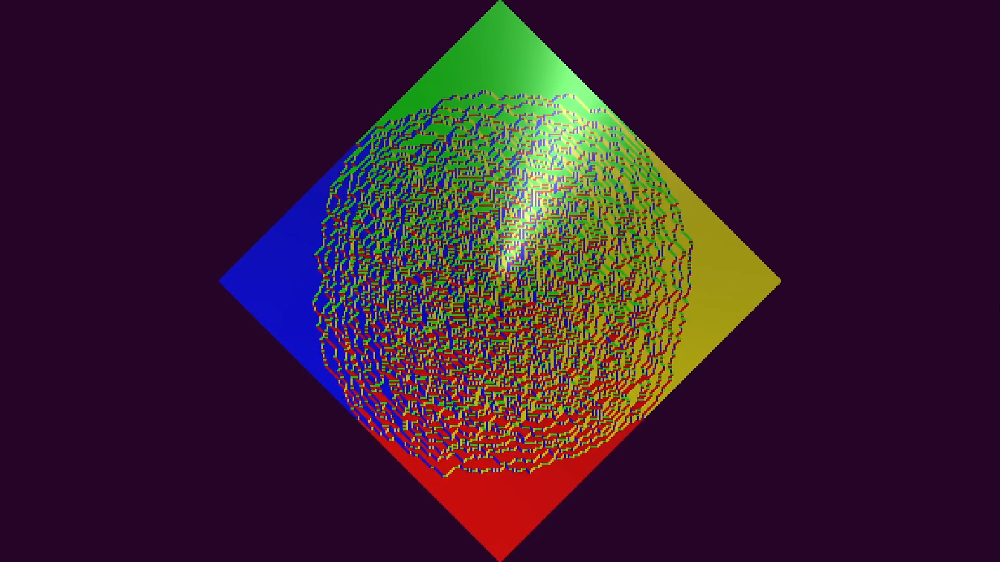

# Arctic Circle Theorem - The Domino of Physicists
 Program in Unity (and C#) to visualize the arctic circle theorem (also called Aztec Diamond Theorem even if they are not the same... for more info read [here](https://en.wikipedia.org/wiki/Aztec_diamond)). A video demonstration is aviable at this [link](https://youtu.be/CIn6HWjbdXU).
 
Together the theorem implementation I had a simple GUI that allow to change the color of the tiles. The GUI appear/disappear with the pressure of the 'X' key. The grid with the tiles evolve with the press of the spacebar.

Inspired by [this Matholeger video](https://www.youtube.com/watch?v=Yy7Q8IWNfHM&t=1051s).

